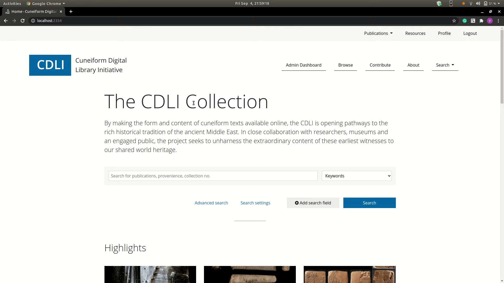

<h1 align="center"> Google Summer of Code 2020 </h1>

<i>with</i> 

<h2 align="center"><a href="https://summerofcode.withgoogle.com/organizations/5003360748437504/">Cuneiform Digital Library Initiative (CDLI)</a></h2>

<h2 align="center"><i>Project Report on "<a href="https://summerofcode.withgoogle.com/projects/#4558611868549120">Improving CDLI Framework</a>" </i> </h2>

## About the project

The main aim of this project was to improve the CDLI framework.

The project focuses on: 
1. Building an authentication and authorization system for the framework.
2. Integrating Elastic Search for Simple Search.
3. Optimizing queries for Advance Search.
4. Preparing search results (Expanded and Compact format) with data pre-processing.

### Links

- [Proposal](assets/CDLI_Framework_Proposal_GSOC_2020.pdf)
- [Weekly Blogs](https://cdli-gh.github.io/blog/gsoc20/search/index)
- [Project Repository](https://gitlab.com/cdli/framework)

## Team

- [Vedant S. Wakalkar](https://github.com/karna98) - Mentee
- [Émilie Pagé-Perron](https://github.com/epageperron) - Mentor

## Technologies

- CakePHP 3
- Elastic Search
- Docker
- Javascript
- HTML

## Objectives Accomplished

1. ### Extend authorization/authentication system
   
   - **ByPassing 2FA ​(TwoFactorAuthentication)**
      
      - *Issue/s:* 

         Users were able to bypass Two Factor Authentication, which is a security issue. 

      - *Solution:*
      
         Issue solved by forcing the user to verify 2FA during login or setup 2FA during registration.

      

      | Login |
      | :---:	|
      |  |
      | When the user submits login credentials, he is redirected to verify 2FA.   If the user attempts to bypass 2FA by any means than the user has to resubmit login credentials. |

      

      

      | Register |
      | :---:	|
      |  |
      | On successful submission of the register form, the user is redirected to set up 2FA.   If the user attempts to bypass 2FA by any means than the user has to register again. |

      

      - *Outcome/s:* 

        1. The authentication process is made more secure
        2. 2FA is made mandatory for user accounts.

   - **Setting up Role based Access System.**

      - *Issue/s:*

         To set up role-based access.

      - *Solution:*
      
         User is assigned different roles according to which functionality can be accessed. Since the access was too granular, the efficient method was to check if the requested functionality can be accessed based on roles assigned to the user.
    
            Psudo Code:

               // Input : Roles required for specific functionality
               check_roles_present( roles_required_array ) {
                  
                  // Get roles of current logged in user
                  get_users_roles = getLoggedInUserRole();
                  
                  // check if user contains roles present in roles_required_array
                  intersect_role = array_intersect(get_users_roles, roles_required_array)

                  // If intersect_role is empty the user cannot access requested fuctionality
                  if (empty(intersect_role)) {
                     return 0;
                  } else {
                     return 1;
                  }
               }

      - *Outcome/s:* 

         Set up Role-based access successfully.

   - **Strong Password checker.**

      - *Issue/s:*

         To implement a password checker to make the password harder to crack and secure.

      - *Outcome/s:* 

         Password checker implemented to set up a more secure password.

   - **Implement Password Retrieval.**

      - *Issue/s:*

         No password retrieval functionality present.

      - *Solution:*
      
         Implemented forgot password functionality with additional 2FA security layer.

      - *Outcome/s:* 

         1. Password retrieval functionality implemented.
         2. 2FA verification added before changing password using retrieval link.

   - **Fix ‘/logout’**
      
      - *Issue/s:*

         Users can add ‘/logout’ to the base URL resulting user gets logged out.  

      - *Solution:*
      
         Previously, the user was able to logout using the GET Request, which possesses a security threat. Fixed by accepting only logout POST REQUEST.

      

      | Logout |
      | :---:	|
      |  |
      | When the user tries to logout using GET Request he is redirected to page with logout form and on submitting the user gets successfully logged out. |

      

      - *Outcome/s:* 

         Logout restricted to POST requests. 

   - **Making Account Inactive (After inactivity period more than 6 months).**

      - *Issue/s:*

         To disable user account when the user is inactive for more than 6 months.
      - *Outcome/s:* 

         Database event created to disable a user account.

2. ### Simple Search

   - *Issue/s:*

      Upgrade current Simple search to ElasticSearch based search.

   

   | Simple Search |
   | :---:	|
   |  |
   | 1. When the user tries to search **india** in **Collection** search category.   2. When the user tries to search using regex expression **india\*** in the same search category. |

   

   - *Outcome/s:* 

      1. Implemented ElasticSearch based Simple Search.
      2. Supports Pagination.
      3. 10x times faster than previous Simple Search.  

3. ### Advanced Search

   - *Issue/s:*

      Optimize current Advanced Search Queries.

   

   | Advanced Search |
   | :---:	|
   |  |
   | 1. When the user tries to search `collection =`*`india*`* AND `material =`*`limestone`* using Advanced Search.   2. Then the user modifies current Advanced Search by updating `material =`*`clay`*.   3. Once again the user modifies current Advanced Search by `author =`*`Widell`*.  |

   

   - *Outcome/s:* 

      1. Re-implemented Advacned Search from scratch.
      2. Expanded ElasticSearch support for Advanced Search.
      3. Added filter support for Advacned Search.
      4. Caching set of results to fetch next set of results.
      5. Able to retrive 0.3 million results within minutes.

4. ### Search funtionality 
   - **Search Settings**
      
      - *Issue/s:*

         To modify the search results page based on the Search Settings set for filters and results per page.

      

      | Search Settings |
      | :---:	|
      |  |
      | a |

      

      - *Outcome/s:*
         
         Search Settings reflected in the search results page for both Simple and Advanced Search.

   - **Filters**

      - *Issue/s:*

         To develop functionality for an interface that allows users to filter search results quickly based on filter values.

      

      | Filters |
      | :---:	|
      |  |
      | Applying filters to the search results. |

      

      - *Outcome/s:*
         
         Implemented filter functionality successfully.

   - **Expanded and Compact View**

      - *Issue/s:*

         Users must be able to view search results in the expanded and compact version with all information displayed according to view.

      

      | Expanded and Compact View |
      | :---:	|
      |  |
      | The user switching between Expanded view and Compact view. |

      

      - *Outcome/s:*
         
         Support for Expanded and Compact view added.

5. ### RocketChat Integration

   RocketChat is a free Open Source Solution for team communications. The main aim is to set up RocketChat on own CDLI servers.

   - *Outcome/s*

      RocketChat deployed on the CDLI server for CDLI Developers Community. 

## Deliverables

1. ### Essential Objectives

      |\#|Objectives|Associated Deliverables|Status|Remarks|
      |:---:|---|---|:---:|---|  
      |1   	| Authentication (2FA)|Established more secure login by enforcing 2FA. | ✔️ |  
      |2   	| Authorization Setup (Role-Based) | Successfully set up role-based access. | ✔️ |    
      |3   	| Simple Search | Integrating Elastic Search for fast and accurate search results. | ✔️ |  
      |4   	| Advanced Search Optimization | Optimized advanced search queries. | ✔️ |   
      |5   	| Search Result display | a. Expanded & Compact result. b. Stats for Search Result. c. Search Filters. d. Search Setting Page. | ✔️ |  *Stats for Search Result* yet to be addressed.  |

2. ### Additional Objectives

      |\#|Objectives|Associated Deliverables|issue(s)|Remarks|  
      |---|---|---|:---:|---|  
      |1   	| Search Settings | A separate setting page for displaying search page and search result according to configuration. |  ✔️ |  
      |2   	| RocketChat Setup | Setting up and deploying RocketChat for CDLI Developers. |✔️|  

## Contributions

* [Merge Requests](https://gitlab.com/cdli/framework/-/merge_requests?scope=all&utf8=%E2%9C%93&state=merged&author_username=Karna98)

* [Issues Created](https://gitlab.com/cdli/framework/-/issues?scope=all&utf8=%E2%9C%93&state=opened&author_username=Karna98)

## To Do (Post GSoC)

* Add filter support for Simple Search.
* Documentation (Modules to be documented).

## Acknowledgement

* I would like to thank my mentor [Émilie Pagé-Perron](mailto:epp@ucla.edu) for helping and guiding throughout the GSoC journey! 
* Thanks to other mentees and mentors for collaboration. 
* I am thankful to Google Summer Of Code for providing me with an opportunity to work with CDLI.

## Final Presentation Video 

